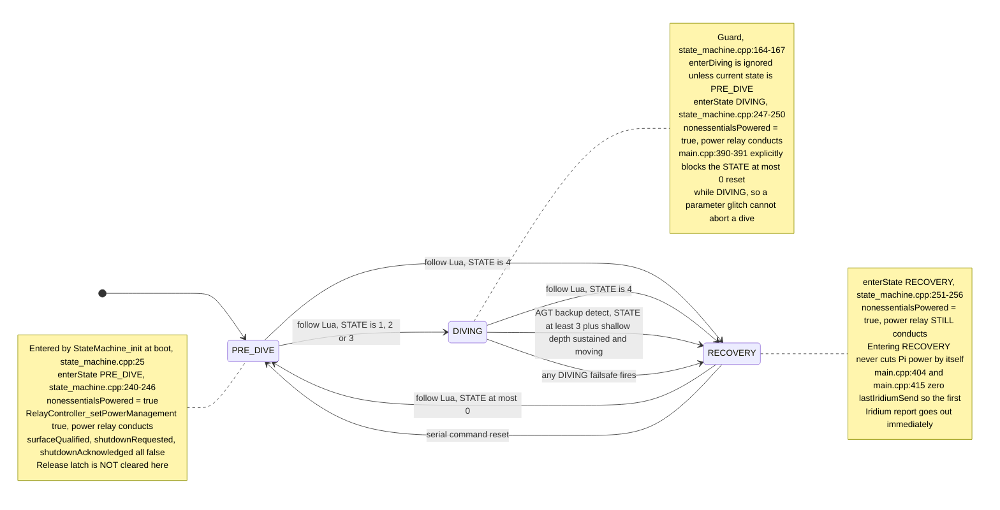
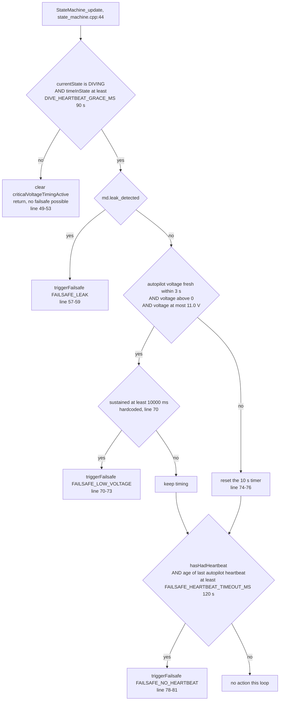
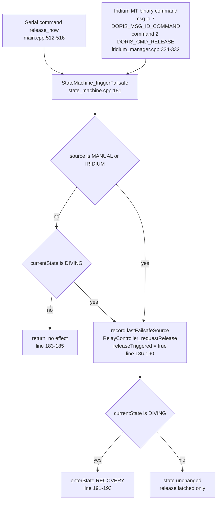
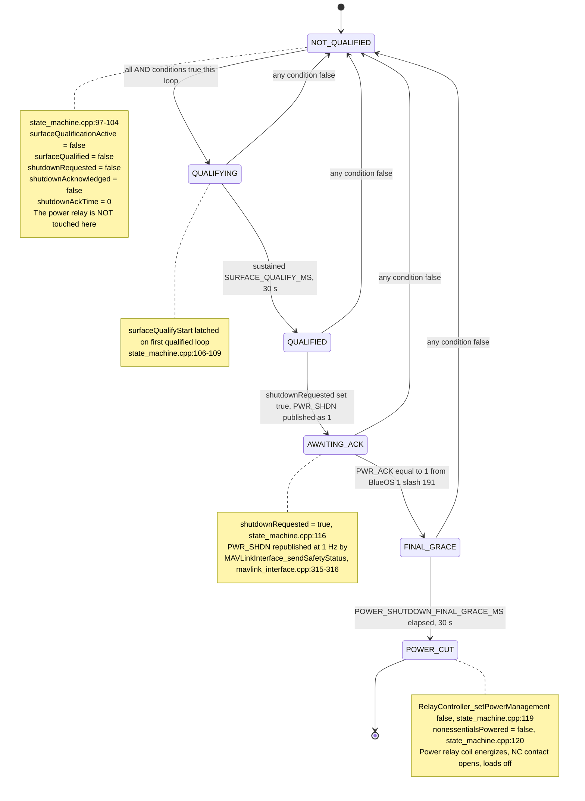
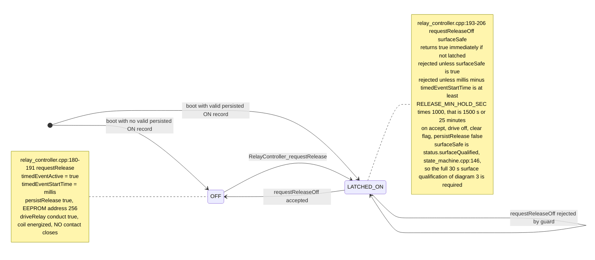
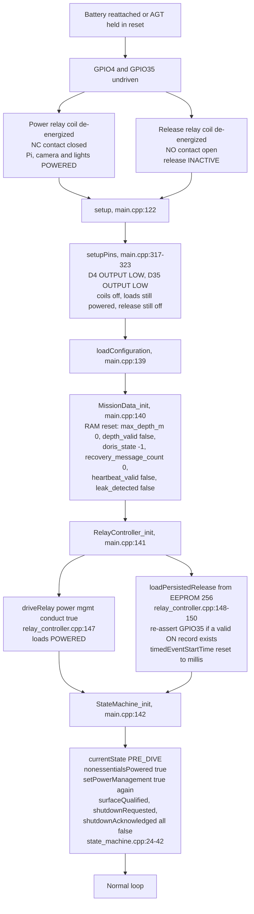

# State Machine Diagrams

Visual reference for the AGT state machine exactly as implemented on
`next/0.3.x`. Every transition below is traceable to a specific line of code;
citations are given as `file:line`. Where the code and the prose documentation
disagree, the code wins and the discrepancy is recorded under
[Findings](#findings).

Two independent state machines are involved and must not be confused:

- the **AGT state machine** (`SystemState`, three states) that this document
  describes;
- the **Lua mission state** on ArduSub, which the AGT only *observes* as a
  numeric `NAMED_VALUE_FLOAT` named `STATE`.

## Lua mission state numbering

The AGT never sees Lua's state names, only the number. The mapping is fixed by
`doris.lua:90-95` in the `blueos-doris-0.6` repository and is published every
`UPDATE_INTERVAL_MS` (500 ms, `doris.lua:70`) by `update_telemetry`
(`doris.lua:718`):

| Value | Lua constant | Notes |
|-------|--------------|-------|
| -1 | `STATE_CONFIG` | Lua's initial value on script start |
| 0 | `STATE_MISSION_START` | |
| 1 | `STATE_DESCENT` | |
| 2 | `STATE_ON_BOTTOM` | |
| 3 | `STATE_ASCENT` | |
| 4 | `STATE_RECOVERY` | terminal within one Lua script run, `doris.lua:1588` |

The AGT accepts the value only from system/component `1/1`, only if finite,
only if within 0.1 of an integer, and only if in the inclusive range -1 to 4
(`src/modules/mavlink_interface.cpp:470-475`).

## 1. Main state machine

Transition sources, line by line:

| From | To | Trigger | Code |
|------|----|---------|------|
| boot | `PRE_DIVE` | unconditional | `state_machine.cpp:25` via `main.cpp:142` |
| `PRE_DIVE` | `DIVING` | `dorisState` in 1..3 | `main.cpp:396-399` |
| `PRE_DIVE` | `RECOVERY` | `dorisState` at least 4 | `main.cpp:402-405` |
| `DIVING` | `RECOVERY` | `dorisState` at least 4 | `main.cpp:402-405` |
| `DIVING` | `RECOVERY` | `dorisState` at least 3 AND fresh `depth_m` below `RECOVERY_DEPTH_THRESHOLD_M` (1.5 m), sustained `SURFACE_QUALIFY_MS` and spanning at least `SURFACE_DEPTH_LIVENESS_M` | `StateMachine_updateSurfaceBackstop` |
| `DIVING` | `RECOVERY` | any failsafe reaches `enterState` | `state_machine.cpp:191-193` |
| `RECOVERY` | `PRE_DIVE` | `dorisState` at most 0 | `main.cpp:390-393` |
| `RECOVERY` | `PRE_DIVE` | serial `reset` | `main.cpp:528-531` |

Which mechanism owns which arrow:

- **Following Lua**: the `dorisState` comparisons in `checkStateTransitions()`
  (`main.cpp:383-418`). These use the raw last-received value from
  `MissionData_getDorisState()` with **no freshness check**.
- **AGT independent detection**: only the `DIVING` to `RECOVERY` backup at
  `main.cpp:408-417`, which combines the autopilot's depth with the AGT's own
  u-blox fix. Because `dorisState` at least 4 is already handled one block
  above, this backup is only *additive* for `dorisState == 3` (ascent).
- **Failsafes**: `StateMachine_triggerFailsafe()` (`state_machine.cpp:181-194`),
  detailed in diagram 2.

Transitions that deliberately do **not** exist:

- `RECOVERY` to `DIVING` — `enterDiving()` refuses any source state other than
  `PRE_DIVE` (`state_machine.cpp:164-167`), and `main.cpp:397-398` only calls it
  from `PRE_DIVE`.
- `DIVING` to `PRE_DIVE` — explicitly excluded at `main.cpp:390-391`.
- `PRE_DIVE` to `RECOVERY` by failsafe — `triggerFailsafe` only calls
  `enterState` when already `DIVING` (`state_machine.cpp:191`).

## 2. Failsafe paths

All automatic failsafes are evaluated in `StateMachine_update()`
(`state_machine.cpp:44-82`), which is called once per loop from `main.cpp:197`.

The two operator-initiated failsafe sources take a different route and are not
gated by the grace timer or by the current state:

Per-source summary:

| `FailsafeSource` | Fires in | Qualifying condition | Timer | Effect on release relay | Effect on state |
|------------------|----------|----------------------|-------|-------------------------|-----------------|
| `FAILSAFE_NONE` | n/a | sentinel only, never triggered | n/a | none | none |
| `FAILSAFE_LEAK` | `DIVING` only | `md.leak_detected` true | 90 s dive-entry grace, then immediate | latch ON | to `RECOVERY` |
| `FAILSAFE_LOW_VOLTAGE` | `DIVING` only | fresh autopilot voltage, greater than 0, at most `BATTERY_CRITICAL_VOLTAGE` 11.0 V | 90 s grace, then sustained 10 s | latch ON | to `RECOVERY` |
| `FAILSAFE_NO_HEARTBEAT` | `DIVING` only | at least one heartbeat ever received, then age at least 120 s | 90 s grace | latch ON | to `RECOVERY` |
| `FAILSAFE_MANUAL` | any state | serial `release_now` | none | latch ON | to `RECOVERY` only if already `DIVING` |
| `FAILSAFE_IRIDIUM` | any state | valid MT command frame with `DORIS_CMD_RELEASE` | none | latch ON | to `RECOVERY` only if already `DIVING` |

`md.leak_detected` is only ever set by the serial test command `set_leak`
(`main.cpp:552-557`). No MAVLink message writes it.

The Iridium MT path only runs inside `iridiumSendText()`, i.e. as the return
leg of an outbound SBD session (`iridium_manager.cpp:319-333`). Because
outbound periodic sends are gated on `StateMachine_canTransmitIridium()`
(`main.cpp:289`), which is true only in `RECOVERY`, the practical reachable
contexts are a `RECOVERY` periodic report or a manually queued
`iridium_test`. In both cases the AGT is not `DIVING`, so `FAILSAFE_IRIDIUM`
latches release without changing state.

## 3. Surface power-cutoff sub-state machine

`StateMachine_updateSurfacePower()` is called every loop from `main.cpp`. It
takes no arguments: the AGT's own GPS fix was removed from this gate because
acquisition after surfacing was measured at up to 38.7 minutes, and power saving
exists precisely to survive a long surface wait.

The single ANDed qualification expression (`state_machine.cpp:87-95`) is:

1. `status.currentState == STATE_RECOVERY`;
2. `MissionData_isDorisStateFresh()` — Lua `STATE` received within
   `MISSION_DATA_FRESHNESS_MS` (3000 ms);
3. `md.doris_state == 4` — exactly Lua `STATE_RECOVERY`;
4. `MissionData_getRecoveryMessageCount()` at least `SURFACE_RECOVERY_MESSAGES`
   (3). The counter increments only when consecutive `STATE=4` reports arrive no
   more than 3 s apart, and resets to 0 on any non-4 value
   (`mission_data.cpp:115-132`);
5. `MissionData_isDepthFresh()` — autopilot depth within 3 s;
6. `md.depth_m` at most `RECOVERY_DEPTH_THRESHOLD_M` (1.5 m);
7. `md.max_depth_m` at least `DIVE_DEPTH_THRESHOLD_M` (2.0 m) — proof that
   *this boot* observed a real dive;
8. depth liveness — across the qualification window the reading must span at
   least `SURFACE_DEPTH_LIVENESS_M` (0.02 m). This replaced the GPS term. Depth
   is now the only sensor evidence not derived from the autopilot's own
   assertion, and a frozen channel reads shallow and steady exactly like a
   floating vehicle, so it has to be shown to be alive.

Everything after step 8 is a plain fall-through in the same function, so the
whole chain is re-evaluated every loop iteration. Any single false condition
takes the sequence straight back to `NOT_QUALIFIED` and clears the ACK, which
means BlueOS must acknowledge again from scratch.

MAVLink messages involved, all `NAMED_VALUE_FLOAT`:

| Name | Direction | Source sysid/compid | Meaning | Code |
|------|-----------|---------------------|---------|------|
| `STATE` | inbound | autopilot `1/1` | Lua mission state | `mavlink_interface.cpp:470-475` |
| `PWR_SHDN` | outbound | AGT `1/192` | 1 while `shutdownRequested`, republished every `POWER_STATUS_INTERVAL_MS` (1 s) | `mavlink_interface.cpp:315-316` |
| `PWR_ACK` | inbound | BlueOS `1/191` only | value in 0.9..1.1 calls `StateMachine_acknowledgeShutdown()` | `mavlink_interface.cpp:491-499` |
| `REL_STAT` | outbound | AGT `1/192` | actual latched GPIO35 state | `mavlink_interface.cpp:313-314` |
| `AGT_CAP` | outbound | AGT `1/192` | capability bitmask `0x3` | `mavlink_interface.cpp:312` |

`StateMachine_acknowledgeShutdown()` (`state_machine.cpp:124-134`) rejects an
ACK unless both `shutdownRequested` and `surfaceQualified` are already true, so
a premature or replayed `PWR_ACK` cannot pre-arm the sequence. A repeated ACK
after the first is idempotent and does not restart the grace timer.

Note that once `POWER_CUT` is reached the relay is never re-closed by this
function; losing qualification afterwards only clears the RAM flags. Power is
restored only by `enterState` (any state entry) or by a boot.

## 4. Release relay latch state machine

The release output is GPIO35 (`RELAY_TIMED_EVENT`), wired through the
**normally-open** contact (`RELAY_TIMED_EVENT_NC` is `false`, `config.h:155`).
Coil off means release inactive.

Callers:

- ON: `StateMachine_triggerFailsafe` (`state_machine.cpp:189`) and
  `StateMachine_handleReleaseCommand(true)` (`state_machine.cpp:142`), the
  latter driven by Lua `RELAY=1` from `1/1`
  (`mavlink_interface.cpp:478-490`).
- OFF: only `StateMachine_handleReleaseCommand(false)`
  (`state_machine.cpp:146`), driven by Lua `RELAY=0`. The result is echoed to
  the link as a `STATUSTEXT` of `RELAY: command accepted` or
  `RELAY: OFF rejected (guard)`.

EEPROM persistence (`relay_controller.cpp:14-59`):

- record lives at byte 256, past `SystemConfig`, enforced by a `static_assert`;
- magic is `REL1` for production builds and `REL0` for `NO_RELAYS` builds, so a
  bench-simulated latch cannot arm a production image;
- the record carries the flag, its bitwise inverse, and a check word; any
  mismatch, wrong magic, or out-of-bounds address fails safe to OFF.

Across an AGT reboot with a persisted latch: `setupPins()` drives GPIO35 LOW
first (`main.cpp:321-322`), so release is momentarily inactive, then
`RelayController_init()` reads the record and re-asserts the pin
(`relay_controller.cpp:148-150`). Critically, `timedEventStartTime` is reset to
`millis()` at line 149, so the 25-minute minimum hold restarts from the reboot,
not from the original latch.

## 5. Boot and power-cycle behavior

What is persisted versus what is reset:

| Item | Storage | Survives power cycle |
|------|---------|----------------------|
| Release latch | EEPROM record at 256 | **Yes**, re-asserted at `relay_controller.cpp:148-150` |
| `SystemConfig` intervals and feature enables | EEPROM below 256 | Yes |
| `SystemState` | RAM | No, always `PRE_DIVE` |
| `max_depth_m` | RAM | No, reset to 0 at `mission_data.cpp:11` |
| `doris_state`, `recovery_message_count` | RAM | No, reset to -1 and 0 |
| `surfaceQualified`, `shutdownRequested`, `shutdownAcknowledged` | RAM | No, all false |
| `nonessentialsPowered` and the physical power relay | RAM plus GPIO | No, forced back ON three times during `setup` |
| Release minimum-hold elapsed time | RAM | No, restarts from boot |

Relay wiring implications while the AGT is unpowered or held in reset
(`config.h:145-155`):

- `RELAY_POWER_MGMT_NC` is `true` and `RELAY_COIL_ACTIVE_HIGH` is `true`. An
  undriven or LOW GPIO4 leaves the coil off, the normally-closed contact
  closed, and the Pi, camera and lights **powered**. Cutting power is an active
  operation that requires a live AGT holding GPIO4 HIGH.
- `RELAY_TIMED_EVENT_NC` is `false`. An undriven or LOW GPIO35 leaves the
  normally-open contact open, so release is **inactive**. Firing release is
  likewise an active operation.

Both defaults are fail-safe in the intended direction: an AGT crash, brownout
or reset restores payload power and de-asserts release.

## 6. Per-state side effects

| | `PRE_DIVE` | `DIVING` | `RECOVERY` |
|---|---|---|---|
| Iridium periodic report | Blocked, `canTransmitIridium` false (`state_machine.cpp:196-198`) | Blocked | Located report every `sysConfig.iridiumInterval` while a fix exists; otherwise an unlocated `SURFACED,NOFIX` report at 2 min then every 30 min (`IridiumSchedule_*`) |
| Iridium manual test | Allowed via `iridium_test` or MAVLink 31013, not state gated (`main.cpp:225`) | Allowed, not state gated | Allowed |
| NeoPixel mode | `LED_MODE_READY` if `MissionData_isArmed()`, else `LED_MODE_ERROR` (`main.cpp:375-380`) | `LED_MODE_LUA` if a Lua LED command is fresh, else `LED_MODE_DIVING` (`main.cpp:366-373`) | `LED_MODE_RECOVERY` strobe (`main.cpp:361-364`) |
| Power relay on state entry | Driven to conduct (`state_machine.cpp:242`) | Driven to conduct (`state_machine.cpp:249`) | Driven to conduct (`state_machine.cpp:255`) |
| Power relay can be opened | No | No | Only through diagram 3 |
| Release relay | Independent, latch preserved, `release_now` and Iridium MT can latch it | Independent, plus all three automatic failsafes after the 90 s grace | Independent, `RELAY=0` can clear it once surface-qualified and past the 25 min hold |
| MAVLink outbound | Heartbeat 1 Hz, `AGT_CAP`, `REL_STAT`, `PWR_SHDN` 1 Hz, GPS 5 Hz | Same | Same |
| Failsafe evaluation | Skipped (`state_machine.cpp:49-53`) | Active after `DIVE_HEARTBEAT_GRACE_MS` | Skipped |

## Findings

Reported for awareness only; nothing here has been changed.

### Documentation that contradicts the code

1. **`CHANGELOG.md:29-31` and `CHANGELOG.md:60`** still describe the obsolete
   `PRE_MISSION` / `SELF_TEST` / `MISSION` / `RECOVERY` machine, including a
   `SELF_TEST` to `MISSION` transition on depth greater than 2 m. No such
   states exist in `SystemState`.
2. **`src/main.cpp:12-15`**, the file header comment, claims
   `PRE_DIVE -> DIVING: depth > threshold (vehicle went underwater)`. The
   actual transition at `main.cpp:396-399` is driven purely by the Lua `STATE`
   value; depth is never consulted for dive entry.
3. **`include/config.h:117`** documents `DIVE_DEPTH_THRESHOLD_M` as
   `Depth > this: PRE_DIVE -> DIVING`. It is used only once, at
   `state_machine.cpp:94`, as the `max_depth_m` proof-of-dive gate for surface
   power qualification.
4. **`include/config.h:120`** documents `DIVE_HEARTBEAT_GRACE_MS` as ignoring
   only the heartbeat timeout. The early return at `state_machine.cpp:49-53`
   suppresses the leak and critical-voltage failsafes as well, so no failsafe
   of any kind can fire during the first 90 s of a dive.
5. **`docs/STATE_MACHINE.md:100`** states `release does not automatically stop
   after 1500 seconds`, which is correct, but the adjacent bullet does not
   mention that `RELEASE_MIN_HOLD_SEC` is expressed in seconds and multiplied
   by 1000 at `relay_controller.cpp:198`, giving a 25-minute floor rather than
   the 1500 ms a reader might assume.

### Dead or unreachable code

6. **`DIVE_MIN_DURATION_MS`** (`config.h:119`) is defined but referenced
   nowhere in `src/`. There is no minimum dive duration before the
   `DIVING` to `RECOVERY` transition, contrary to the comment on that line and
   to `docs/STATE_MACHINE.md` implying an ordered sequence.
7. **`BATTERY_LOW_VOLTAGE`** (`config.h:111`) is unreferenced. Only
   `BATTERY_CRITICAL_VOLTAGE` is used.
8. **`MAVLinkInterface_update()`** (`mavlink_interface.cpp:575-587`) is never
   called; `main.cpp` uses `processSerialInput()` instead, which does its own
   `mavlink_parse_char` loop.
9. **`RelayController_emergencyDisable()`** (`relay_controller.cpp:212`) and
   **`RelayController_triggerTimedEvent()`** (`relay_controller.cpp:168`) are
   never called from `src/`. `triggerTimedEvent` also stores
   `timedEventDurationSeconds`, which nothing ever reads.
10. **`StateMachine_shouldShutdownNonessentials()`** and
    **`StateMachine_isRecoveryStrobe()`** are referenced only by
    `test/test_state_machine/`. Production LED selection reads
    `StateMachine_getState()` directly.
11. **`MissionData_isAutopilotFailsafe()`**, **`hasUnhealthySensors()`**,
    **`isMissionReady()`**, **`hasDorisState()`**, **`getPrearmStatus()`** and
    **`update_voltage()`** are unused outside tests. `SYS_STATUS` sensor health
    and the Lua `PREARM` value are therefore ingested and stored but never
    acted on.
12. **`IridiumManager_sendDorisReport()`** and **`IridiumManager_checkMT()`**
    are never called; the binary `doris_protocol` include is commented out at
    `main.cpp:36`. As a result `DORIS_CMD_SEND_REPORT`, `DORIS_CMD_RESET_STATE`,
    `DORIS_CMD_REBOOT`, `DORIS_CMD_ENABLE_IRIDIUM` and
    `DORIS_CMD_DISABLE_IRIDIUM` have no handler anywhere. Only
    `DORIS_CMD_RELEASE` is acted on, and only inside the text-mode
    `iridiumSendText()` return leg (`iridium_manager.cpp:324-332`).
13. **`DorisMissionState`** in `doris_protocol.h:36-41` enumerates a four-value
    mission state including `DORIS_STATE_FAILSAFE` that does not correspond to
    the current `SystemState`. It is never populated.
14. **`LED_MODE_STANDBY`** is only ever the initial value of `currentMode` and
    the value set by `NeoPixelController_clear()`. `updateLEDState()` never
    selects it, so it is visible only for the first loop iteration.
15. **`SUPPRESS_DEBUG_TEXT` is defined** (`config.h:13`), so every
    `DebugPrint`/`DebugPrintln` compiles to a no-op. The entire serial command
    console — `help`, `status`, `gps`, `debug`, and the confirmation text for
    `release_now`, `reset` and `set_leak` — produces no output in the default
    build. The commands still execute.

### Behavioral gaps worth reviewing

16. **`STATUSTEXT` flood on the `RELAY` path.** Lua publishes the `RELAY` named
    float unconditionally every 500 ms (`doris.lua:70`, `doris.lua:728`). The
    AGT handler at `mavlink_interface.cpp:478-490` emits a `STATUSTEXT` for
    every single one, so the link carries 2 messages per second of either
    `RELAY: command accepted` or `RELAY: OFF rejected (guard)` for the entire
    mission. In particular, Lua calls `deactivate_relay()` on entering its
    `STATE_RECOVERY` (`doris.lua:1581`, `doris.lua:1601`), which after a latched
    release produces a continuous 2 Hz stream of guard-rejection warnings.
17. **`checkStateTransitions()` never checks freshness.** It reads
    `MissionData_getDorisState()` raw (`main.cpp:384`). If the autopilot link
    dies while the last received value was 4, the AGT stays in `RECOVERY`
    indefinitely; if it died at 1..3 during `PRE_DIVE`, the AGT would enter
    `DIVING` on a stale value. `updateSurfacePower` does check freshness, so
    the power cutoff itself is protected, but the mission state is not.
18. **The `RECOVERY` to `PRE_DIVE` reset is hard to reach in practice.** Lua's
    `STATE_RECOVERY` is terminal within a script run (`doris.lua:1588`), and the
    cancel-to-`CONFIG` path at `doris.lua:995` explicitly excludes state 4. A
    `dorisState` of at most 0 therefore only appears after a Lua script restart.
19. **`MissionData_getDorisState()` returns -1 before any `STATE` is received**
    (`mission_data.cpp:24`). This is harmless at boot because the AGT is already
    `PRE_DIVE`, but it means the "follow Lua to `PRE_DIVE`" rule cannot
    distinguish "Lua says CONFIG" from "we have never heard from Lua".
20. **`COMMAND_LONG` handling has no source identity check.**
    `mavlink_interface.cpp:503-568` acts on `MAVLINK_CMD_REBOOT` (31014),
    `MAVLINK_CMD_IRIDIUM_TEST` (31013), `MAVLINK_CMD_LED_CONTROL` and
    `MAVLINK_CMD_MISSION_STATUS` from any sysid/compid, unlike every
    `NAMED_VALUE_FLOAT` path which is strictly gated to `1/1` or `1/191`. A GCS
    or any other MAVLink participant can reboot the AGT.
21. **The Iridium test is not state-gated.** `main.cpp:225` runs the test
    whenever `iridiumTestRequested` is set, including while `DIVING`. The
    session blocks the main loop for tens of seconds to minutes and switches
    the shared antenna away from GNSS.
22. **The critical-voltage sustain window is a bare literal.**
    `state_machine.cpp:70` uses `10000UL` rather than a named constant in
    `config.h`, unlike every other threshold in the failsafe path.
23. **`enterState` re-arms Pi power on every state entry.** All three cases at
    `state_machine.cpp:239-257` call `RelayController_setPowerManagement(true)`.
    If the AGT has already cut power and something later drives a state entry —
    for instance the serial `reset` command, or a Lua restart publishing
    `STATE=-1` while the Pi is coming back up — the power relay closes again.
    This is presumably intentional as a recovery mechanism, but it means the
    cut is not one-way within a single boot.
24. **`RELEASE_MIN_HOLD_SEC` restarts at every reboot.**
    `relay_controller.cpp:149` sets `timedEventStartTime = millis()` before the
    persisted state is even applied, so an AGT reset extends the earliest
    possible release-off by another 25 minutes.
25. **`status.previousState` is written but never read** outside
    `StateMachine_getStatus()`, which no production caller inspects for that
    field.
